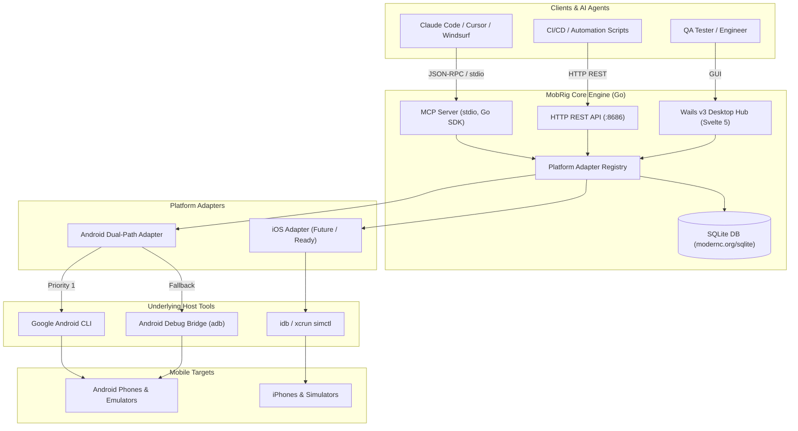

# MobRig

<div align="center">

**High-Performance Mobile Device Control Engine for AI Agents & QA Engineers**

[](https://go.dev)
[](https://nodejs.org)
[](https://svelte.dev)
[](https://sqlite.org)
[](https://modelcontextprotocol.io)
[](LICENSE)

</div>

---

MobRig is a unified, cross-platform mobile device orchestrator and test automation runtime. It bridges physical and emulated mobile devices (Android & iOS) directly to AI coding agents, autonomous test runners, and QA engineers through:

- **Desktop Hub**: Modern Svelte 5 + Wails v3 graphical interface with live device inspection and hardware telemetry.
- **MCP Server**: Stdio-based Model Context Protocol server built with the official Go SDK, exposing 38 tools to AI agents like Claude Code, Cursor, Windsurf, and Gemini.
- **REST API**: RFC 7807 compliant HTTP endpoints running on `http://localhost:8686`.
- **Android Dual-Path Engine**: Optimized execution path favoring Google's `android` CLI tool with automatic fallback to standard `adb`.
- **Embedded Database**: CGO-free SQLite (`modernc.org/sqlite`) managed via embedded Goose migrations.
- **Automated Setup**: One-click environment diagnostics and IDE config generation for Cursor and Claude.

---

## Architecture



---

## Features

### 1. Unified AI Agent Integration (MCP)
MobRig implements the official Go SDK for the Model Context Protocol. AI coding assistants connect over stdio to control devices with natural language:
- **Zero-Friction Aliases**: Every action supports both standard names and `mobile_` prefixed variants (e.g., `tap` and `mobile_tap`, `swipe` and `mobile_swipe`).
- **Clean Stdio Streams**: All operational logs route strictly to `stderr`, keeping `stdout` dedicated to binary-clean JSON-RPC frames.

### 2. High-Speed Android Dual-Path
- Queries available host binaries on startup.
- Executes commands through Google's `android` tool when installed, automatically falling back to standard `adb` without failing requests.

### 3. Svelte 5 Desktop Hub & Inspector
- Real-time connected device gallery with USB/Wi-Fi/Emulator badges and battery/OS indicators.
- Live device screenshot preview inside a phone bezel frame.
- Interactive quick actions (Home, Back, Volume, Rotate, Power).
- Built-in MCP config viewer with one-click clipboard copying.

### 4. Reliable Embedded Persistence
- Runs completely CGO-free using `modernc.org/sqlite`.
- Embedded SQL migrations using `pressly/goose/v3`.
- Tracks hardware fingerprints, device quirks (vendor-specific timeouts, wake-up delays), test execution runs, and failure logs.

---

## Installation & Quick Start

### Option A: Prebuilt Binaries
Download the latest prebuilt release for your operating system from [GitHub Releases](https://github.com/TheJenilDGohel/MobRig/releases):
- **Windows**: `mobrig-windows-amd64.exe`
- **Linux**: `mobrig-linux-amd64`
- **macOS (Apple Silicon)**: `mobrig-darwin-arm64`
- **macOS (Intel)**: `mobrig-darwin-amd64`

### Option B: Build from Source

#### Prerequisites
- **Go**: 1.24 or higher
- **Node.js**: 22 or higher
- **Task** (optional, recommended): `go install github.com/go-task/task/v3/cmd/task@latest`
- **Android SDK / Platform Tools**: Ensure `adb` is on your system `PATH`.

```bash
# Clone the repository
git clone https://github.com/TheJenilDGohel/MobRig.git
cd MobRig

# Install frontend dependencies and build assets
cd ui && npm install && npm run build && cd ..

# Build using Task
task build

# Or build directly with Go
go build -o mobrig ./cmd/mobrig
```

---

## CLI Usage

### 1. Launch the Desktop Hub & REST API
```bash
# Start MobRig Desktop GUI and HTTP REST API daemon (:8686)
mobrig
```

### 2. Start MCP Server (for AI Agents)
```bash
# Run stdio MCP server (used by Cursor, Claude Code, Windsurf)
mobrig mcp
```

### 3. Run Environment Diagnostics & Auto-Setup
```bash
# Detect installed mobile tools and configure IDEs
mobrig setup
```
MobRig will:
- Check for `adb` and Google's `android` CLI tool.
- Provide OS-specific installation instructions if tools are missing.
- Automatically update or generate configuration in:
  - `.cursor/mcp.json` (Cursor IDE)
  - `.mcp.json` (Claude Code)
  - `claude_desktop_config.json` (Claude Desktop)

### 4. Check Version
```bash
mobrig version
```

---

## AI Agent Integration Guide

MobRig can be plugged directly into your favorite AI tool.

### Cursor IDE
Add to `.cursor/mcp.json`:
```json
{
  "mcpServers": {
    "mobrig": {
      "command": "mobrig",
      "args": ["mcp"]
    }
  }
}
```

### Claude Code
Add to `.mcp.json`:
```json
{
  "mcpServers": {
    "mobrig": {
      "command": "mobrig",
      "args": ["mcp"]
    }
  }
}
```

### Claude Desktop
Add to your `claude_desktop_config.json`:
```json
{
  "mcpServers": {
    "mobrig": {
      "command": "mobrig",
      "args": ["mcp"]
    }
  }
}
```

*(Tip: Run `mobrig setup` in your project folder to automatically write these configurations).*

---

## HTTP REST API Reference

The MobRig daemon serves an RFC 7807 compliant REST API on `http://localhost:8686`.

| Method | Endpoint | Description |
|---|---|---|
| `GET` | `/health` | Service health, version, and uptime |
| `GET` | `/api/v1/devices` | List all connected devices with state |
| `GET` | `/api/v1/devices/{id}` | Get detailed device hardware & battery info |
| `GET` | `/api/v1/devices/{id}/screenshot` | Capture device screenshot (JSON or raw PNG) |
| `GET` | `/api/v1/devices/{id}/ui-tree` | Retrieve accessibility hierarchy as JSON |
| `GET` | `/api/v1/devices/{id}/elements?text=...` | Query UI elements by text or ID |
| `POST` | `/api/v1/devices/{id}/tap` | Tap screen coordinates or element index |
| `POST` | `/api/v1/devices/{id}/double-tap` | Double tap coordinates |
| `POST` | `/api/v1/devices/{id}/long-press` | Long press coordinates with duration |
| `POST` | `/api/v1/devices/{id}/swipe` | Swipe across coordinates or direction |
| `POST` | `/api/v1/devices/{id}/type` | Enter text (with optional auto-submit) |
| `POST` | `/api/v1/devices/{id}/key` | Send Android key event code |
| `POST` | `/api/v1/devices/{id}/home` | Press device Home button |
| `POST` | `/api/v1/devices/{id}/apps/launch` | Launch package / activity |
| `POST` | `/api/v1/devices/{id}/apps/terminate` | Stop running application |
| `POST` | `/api/v1/devices/{id}/apps/install` | Install APK / application package |
| `POST` | `/api/v1/devices/{id}/apps/uninstall` | Uninstall application package |
| `POST` | `/api/v1/devices/{id}/apps/clear-data` | Clear app cache and user data |
| `POST` | `/api/v1/devices/{id}/open-url` | Open deep link or web URL |

---

## MCP Tool Catalog (38 Endpoints)

All tools are available with dual names (e.g. `tap` and `mobile_tap`):

- **Device Discovery**: `list_devices`, `get_screen_size`, `get_orientation`, `get_current_activity`
- **Visual & UI Inspection**: `get_screenshot`, `save_screenshot`, `get_ui_tree`, `find_element`, `wait_for_element`
- **Gestures & Input**: `tap`, `double_tap`, `long_press`, `swipe`, `type_text`, `press_button`, `go_home`
- **App Management**: `launch_app`, `terminate_app`, `install_app`, `uninstall_app`, `clear_app_data`, `list_apps`, `open_url`
- **Device Controls & Diagnostics**: `set_rotation`, `toggle_wifi`, `toggle_airplane_mode`, `grant_permissions`, `get_notifications`, `get_device_logs`
- **Screen Recording & Automation**: `start_recording`, `stop_recording`, `get_recording`, `list_recordings`, `run_test`
- **Pairing**: `pair_wireless`, `connect_wireless`

---

## Testing & Quality Assurance

Run the comprehensive test suite:

```bash
# Run all Go tests (unit, integration, and E2E)
go test -v ./...

# Run frontend typecheck and tests
cd ui && npm run check && cd ..

# Run E2E integration tests
go test -v ./test/...
```

---

## License

This project is licensed under the MIT License - see the [LICENSE](LICENSE) file for details.
